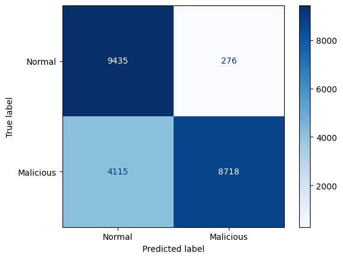
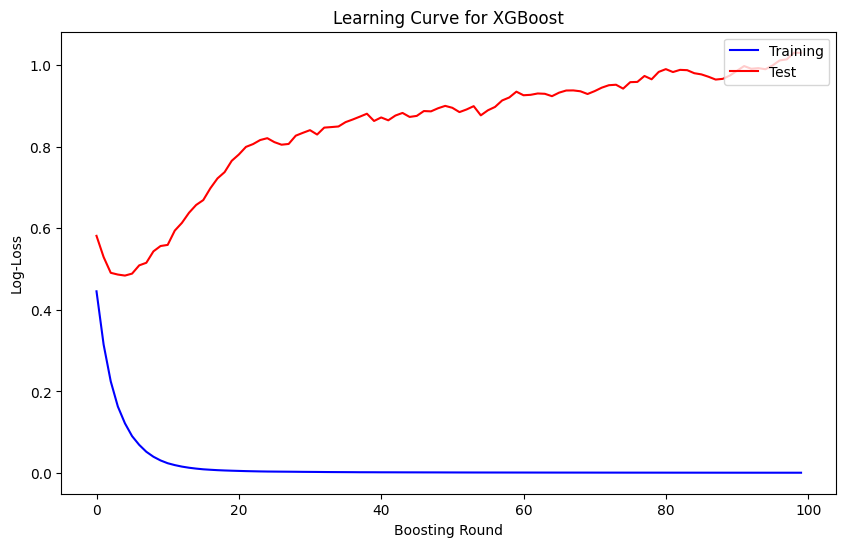

# Abnormal Network Detection with XGBoost

## Overview
This project implements a machine learning solution for detecting abnormal network packet using the XGBoost algorithm. By analyzing network packet patterns and characteristics from the NSL-KDD dataset, the model can effectively identify potential network intrusions and anomalies.

## Objective
The main objectives of this project are:
- To develop a robust anomaly detection system for network security
- To leverage the power of XGBoost for accurate classification of normal vs. abnormal network traffic
- To demonstrate the effectiveness of machine learning in cybersecurity applications
- To provide a scalable solution that can handle large volumes of network traffic data
- Research about XGBoost
## Dataset
This project utilizes the NSL-KDD dataset, which is an improved version of the original KDD Cup 1999 dataset. The NSL-KDD dataset addresses some of the inherent problems in the original KDD dataset and is widely used for network intrusion detection research.

### Dataset Characteristics
- Balanced class distribution
- No redundant records in the training set
- Reasonable number of records in both training and testing sets
- 41 features capturing various aspects of network connections
- Multiple attack categories: DoS, R2L, U2R, and Probe

### Features Include:
- Basic features (e.g., duration, protocol_type, service)
- Content features (e.g., number of failed logins)
- Traffic features (e.g., count, srv_count)
- Host-based features (e.g., dst_host_count)

## Model
The project employs XGBoost (eXtreme Gradient Boosting), a powerful machine learning algorithm known for its:

### Key Characteristics
- High performance and speed
- Built-in handling of missing values
- Tree pruning using "max_depth" parameter
- Regularization to prevent overfitting

### Model Architecture
- Gradient boosting framework
- Binary classification setup (Normal vs. Malicious)
- Feature importance analysis capability
- Hyperparameter optimization through cross-validation (Not done yet)

### Model Parameters (Not Optimized Yet)
```python
xgb = XGBClassifier(
        n_estimators= 100,
        use_label_encoder= False,
        max_depth= 8,
        booster= 'gbtree',
        subsample= 0.5,
        colsample_bytree= 0.5,
        importance_type= 'gain',
        objective='binary:logistic',
        eval_metric='logloss',
)
```
## Prerequisites
- Python 3.8 or later
- Jupyter Notebook on-premise (You can run on Colab or Kaggle too)
## Installation and Setup
### On Local
```bash
# Clone the repository
git clone https://github.com/ztrap123/Abnormal-Network-Detection-with-XGBoost.git
```
### On Google Colab
[Abnormal Network Detection with XGBoost](https://colab.research.google.com/drive/15ODANjYMjsa4T8Ix5dL7oynnRCU0DEWJ?usp=sharing)

## Results
Our model achieves the following performance metrics:
- Accuracy: ~80% on test set
- Precision: ~96%
- Recall: ~67%
- F1-Score: ~79%

**=> It is overfitting** 

### Confusion Matrix

The Recall is low due to the True Negative is many. 4115 are malicious but label as Normal

### Learning Curve of XGBoost

The line of Training is perfect for a learning curve, but the Test line is otherwise. It is good at first but then It start rising.

**=> Sign that it has problems. The Test line also should similar to the Training. The more it close to zero, the more perfect the model**
## Dependencies
- Python 3.8+
- XGBoost
- NumPy
- Pandas
- Scikit-learn
- Matplotlib
- Seaborn

## Contributing
Contributions are welcome! Please feel free to submit a Pull Request.

## License
This project is licensed under the MIT License - see the LICENSE file for details.

## Acknowledgments
- NSL-KDD dataset providers ([StrGenIx | Laurens D'hooge](https://www.kaggle.com/datasets/dhoogla/nslkdd))
- XGBoost development team
- Contributors and researchers in the network security community